<h1 align="center">
    
</h1>

<h1 align="center">

[](https://forthebadge.com)
[](https://forthebadge.com)
[](https://forthebadge.com)

</h1>


<h1 align="center">
    <a href="https://app.rocketseat.com.br/starter">Starter</a>
    
</h1>

<h2>📌 Índice</h2>

- [📖 Introdução](#-introdução)
  - [O que significa o ES6, ES7, ES8?](#o-que-significa-o-es6-es7-es8)
  - [Afinal o que é o ECMAScript?](#afinal-o-que-é-o-ecmascript)
  - [Antes e depois do ES6](#antes-e-depois-do-es6)
  - [Babel](#babel)
  - [O que vamos ver sobre o ES6?](#o-que-vamos-ver-sobre-o-es6)
- [🚀 Instalando Node & Yarn](#-instalando-node--yarn)
  - [Node.js](#nodejs)
  - [Yarn](#yarn)
- [🚀 Configurando o Babel](#-configurando-o-babel)
  - [Começando a configuração do Babel](#começando-a-configuração-do-babel)
- [🚀 Classes](#-classes)
  - [Herança](#herança)
  - [Métodos estáticos](#métodos-estáticos)
- [🚀 Const & Let](#-const--let)
  - [Const](#const)
  - [Let](#let)
- [🚀 Operações em Vetores](#-operações-em-vetores)
  - [Map](#map)
  - [Reduce](#reduce)
  - [Filter](#filter)
  - [Find](#find)
- [🚀 Arrow Functions](#-arrow-functions)
- [🚀 Valores padrão](#-valores-padrão)
- [🚀 Desestruturação](#-desestruturação)
- [🚀 Operadores Rest/Spread](#-operadores-restspread)
  - [Rest](#rest)
  - [Spread](#spread)
- [🚀 Template Literals](#-template-literals)
- [🚀 Object Short Syntax](#-object-short-syntax)
- [📜 Licença](#-licença)

---

## 📖 Introdução

### O que significa o ES6, ES7, ES8?

O **ES** é uma sigla para [ECMAScript](https://www.ecma-international.org/publications/standards/Ecma-262.htm) e o número depois é a versão, basicamente essa versão corresponde ao ano +1, ou seja o ES6 é o ECMAScript 2015.

### Afinal o que é o ECMAScript?

ECMAScript é o responsável por formular as novas regras e funcionalidades da linguagem JavaScript.

### Antes e depois do ES6

Para quem já programava em JavaScript antes do ES6 e depois, percebe que são duas linguagens completamente diferentes, você usa a mesma sintaxe, porém existem muitas funcionalidades novas que vieram com o pacote ES6.

### [Babel](https://babeljs.io/) 

O JavaScript avança muito rápido, já os navegadores são um pouco lentos para acompanhar está evolução. Então os navegadores podem não entender algumas funcionalidades do ES6, ES7, ES8. O Babel basicamente pega o código que você escreveu com as novas funcionalidades da linguagem e transpila (converte) para um código que todos navegadores entendam. 

### O que vamos ver sobre o ES6?

- [x] Webpack
- [x] Classes
- [x] Arrow functions
- [x] Desestruturação
- [x] Rest/Spread
- [x] Import/Export
- [x] Async/Await

## 🚀 Instalando Node & Yarn

Antes de começar os estudos, vamos precisar de duas ferramentas muito importantes, só com elas vamos conseguir instalar as dependências de nossos projetos.

### [Node.js](https://nodejs.org/en/download/)

Após você instalar o Node, você irá verificar se foi instalado corretamente **executando o seguinte comando no seu terminal:**

``` bash
node -v

## Este comando precisa retornar com a versão instalada do Node
```

### [Yarn](https://classic.yarnpkg.com/en/)

O Yarn é um gerenciador de pacotes do JavaScript. Após instalado, você também irá verificar **executando o seguinte comando no seu terminal:**

``` bash
yarn -v

## Este comando precisa retornar com a versão instalada do Yarn
```

## 🚀 Configurando o Babel

Primeiramente você vai criar um projeto, dentro da pasta **execute o seguinte comando:**

``` bash
yarn init -y

## O "-y" vai responder sim automaticamente para todas perguntas da instalação.
```

Após rodar este comando, será criado um arquivo chamado **package.json** na raíz de nosso projeto. Ele vai armazenar as informações de depêndencias da nossa aplicação.

O próximo passo é instalar as primeiras dependências do nosso projeto, **execute o seguinte comando usando o yarn:**

``` bash
yarn add @babel/cli @babel/preset-env @babel/core

## Assim serão instaladas as dependências, fique tranquilo, isso pode demorar um pouco.
```

Quando as dependências terminarem de ser instaladas serão criados dois arquivos o **yarn.lock** que é apenas uma forma de cache do yarn e uma pasta **node_modules**, está pasta irá armazenar todas as dependências do nosso projeto, essas dependências também poder ter dependências e assim por diante. Você não precisa se preocupar com esses dois arquivos.

> Se você vai usar o Git como controle de versão, essa é uma bora hora para criar o arquivo **.gitignore** e adicionar a pasta **node_modules.**

### Começando a configuração do Babel 

Primeiro, crie um arquivo na raíz do projeto com o nome de **.babelrc**

Dentro deste arquivo, **coloque o seguinte código:**

<h2 align="center">
    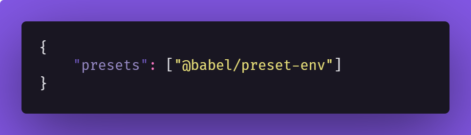
</h2>

O preset-env basicamente vai entender qual ambiente estamos trabalhando, no caso no navegador e vai converter o código de forma que os navegadores entendam. 

Agora vamos criar dois arquivos, **index.html** e **main.js**

No arquivo **main.js**, vamos adicionar o seguinte código: 

<h2 align="center">
    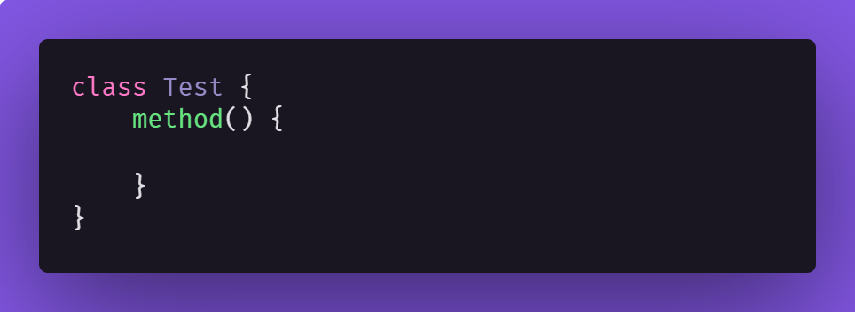
</h2>


E no **package.json** vamos adicionar uma nova propriedade chamada ``"scripts"`` e vamos definir o nosso primeiro script. Esses mesmos são formas de executar comandos do terminal que façam mais de uma coisa.

**Como vai ficar a nova propriedade:**

<h2 align="center">
    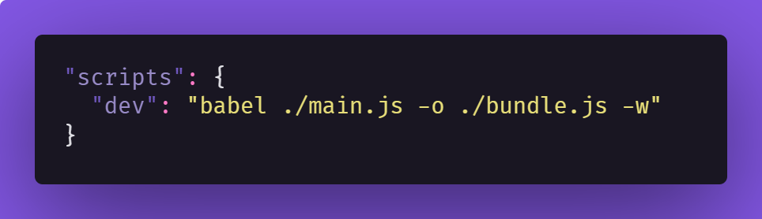
</h2>

O script ``"dev"`` vai executar o Babel pegando o arquivo **main.js** e enviando convertido para outro arquivo chamando **bundle.js**

O parâmetro ``-w`` vai ficar monitorando nosso arquivo **main.js** e a cada mudança ele vai automaticamente converter e enviar para o **bundle.js**

Depois de salvarmos o arquivo, **vamos executar o seguinte comando no terminal:**

``` bash
yarn dev
```

E finalmente, você irá reparar o novo arquivo **bundle.js**, seu conteúdo será o código do **main.js** convertido para versões mais antigas do JavaScript.

## [🚀 Classes](https://developer.mozilla.org/pt-BR/docs/Web/JavaScript/Reference/Classes)

Antigamente não era possível usar classes em JavaScript, hoje você pode usar tranquilamente.

**Agora vamos ver exemplos do uso de classes:**

<h2 align="center">
    
</h2>

No código acima declaramos uma classe chamada ``TodoList`` e definimos dois métodos. 

O primeiro método é o ``constructor()`` ele vai ser o primeiro método executado toda vez que um objeto for instanciado a partir da classe. E no nosso constructor estamos iniciando a variável ``todos`` que recebe um array vazio inicialmente.

O segundo método se chama ``addTodo()`` e nele estamos adicionando um novo item ao array criado no constructor.

Após isso, nos vamos instanciar essa classe na variável ``myList``, usando a palavra chave ``new``

E por último estamos pegando um botão de nosso HTML e adicionando uma função de clique. Toda vez que clicamos no botão será chamado o método ``myList.addTodo()`` 

### Herança

<h2 align="center">
    
</h2>

No código acima criamos uma nova classe chamada ``List`` e adicionamos métodos com a mesma função do exemplo anterior.

Agora na classe ``TodoList`` nós estamos extendendo os métodos e propriedades da classe ``List`` usando a palavra chave ``extends``

Nós teremos o mesmo funcionamento de antes, a diferença é que estamos herdendo propriedades de outra classe.

**Agora vamos supor que nós queiramos adicionar mais informações na classe que herdou a outra, por exemplo um nome de usuário.**

<h2 align="center">
    
</h2>

Para chamar o constructor da classe pai e criar novas propriedades nós usamos o método ``super()``

### Métodos estáticos

Com os métodos estáticos, nós não precisamos usar o ``new`` para chamar algum método da classe.

<h2 align="center">
    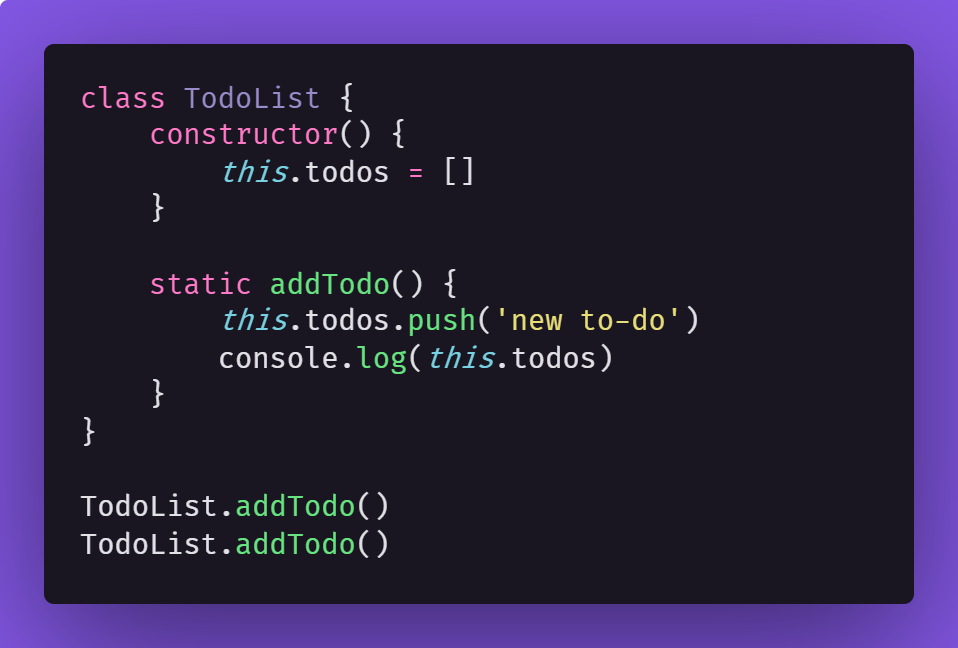
</h2>

No código acima um erro seria retornado, quando definimos um método estático **ele não tem acesso ao restante da classe**, então ele não vai enxergar o ``this.todos``

Normalmente usamos este tipo de método para passar uma informação e ele retornar outra, independente do restante da classe.

<h2 align="center">
    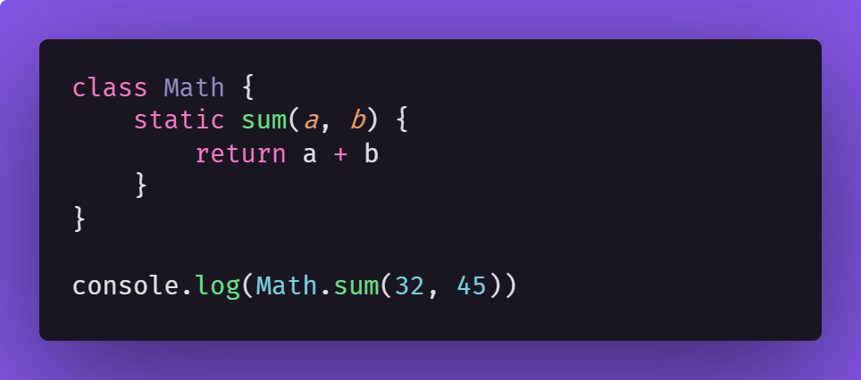
</h2>

No código acima criamos uma classe chamada ``Math`` com o método ``sum`` que basicamente pega dois valores e retorna a soma.

Após isso chamamos o método passando os dois valores e ele nos retorna a soma. Você pode reparar que não precisamos instanciar nenhum objeto pois o método é estático.

## 🚀 Const & Let

Se você programa o JavaScript básico, provavelmente conhece a palavra-chave ``var`` para declarar variáveis. Porém a partir do ES6 nós temos outras duas formas de declarar uma variável, usando a palavra ``let`` ou ``const``

<h2 align="center">
    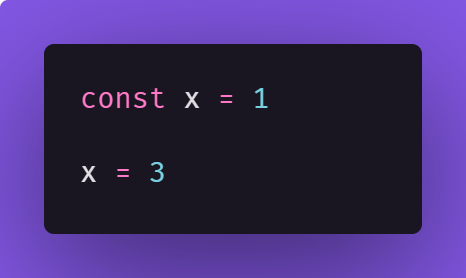
</h2>

### [Const](https://developer.mozilla.org/pt-BR/docs/Web/JavaScript/Reference/Statements/const)

``const`` é uma constante, e não pode ter seu valor reatribuído, no exemplo acima o código retornaria um erro, pois estamos tentando reatribuir um novo valor.


<h2 align="center">
    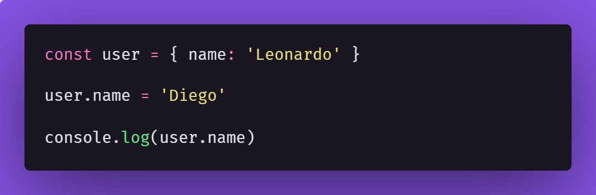
</h2>

### [Let](https://developer.mozilla.org/pt-BR/docs/Web/JavaScript/Reference/Statements/let)

``let`` é uma variável de escopo.

<h2 align="center">
    
</h2>

No código acima, temos um exemplo de uso deste tipo de variável. Podemos perceber que diferente da ``const`` ela pode ter seu valor reatribuído.

Como dito ``let`` é uma variável de escopo, a cada abertura e fechamento de chaves consideramos um escopo. Ou seja como a variável ``y`` está dentro do escopo da função, se tentarmos dar um ``console.log(y)`` fora da função, nós **não vamos conseguir acessar o valor**.

## 🚀 Operações em Vetores

Antigamente se você quisesse manipular vetores ou realizar ações em cada item do vetor era necessário o uso do ``for`` ou até de bibliotecas de terceiros.

Com o ES6 temos várias novas funcionalidades para manipulação de vetores, vamos ver algumas abaixo:

### [Map](https://developer.mozilla.org/pt-BR/docs/Web/JavaScript/Reference/Global_Objects/TypedArray/map)

A função do ``map`` é percorrer um vetor e executar uma ação escolhida em cada item.

<h2 align="center">
    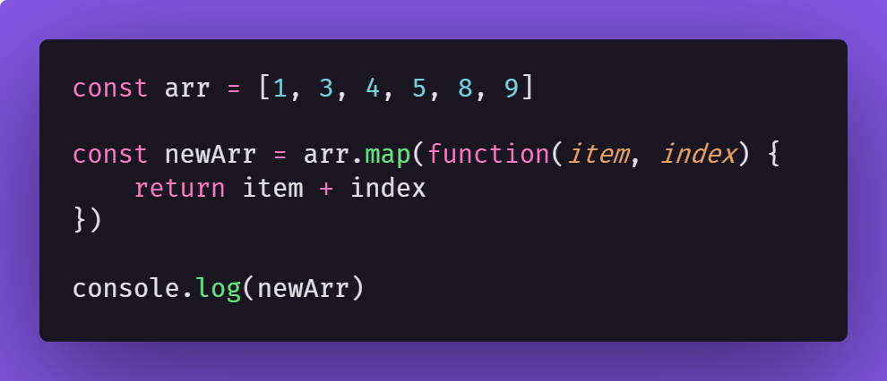
</h2>

No código acima temos um vetor de números e vamos criar um novo vetor chamado ``newArr``, com o uso do map.

O ``map`` é uma função que recebe como parâmetro outra função e nesta mesma recebemos **cada item** do vetor. Na nossa função estamos pegando os itens, somando com seus índices e retornando o resultado.

**O resultado seria:** ``[1, 4, 6, 8, 12, 14]``

### [Reduce](https://developer.mozilla.org/pt-BR/docs/Web/JavaScript/Reference/Global_Objects/Array/Reduce)

O ``reduce`` é uma forma de nós consumirmos todo nosso vetor e transformar em uma única informação.

<h2 align="center">
    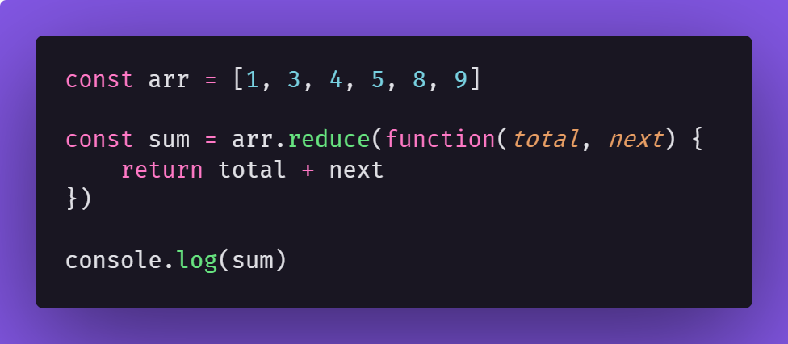
</h2>

No código acima estamos realizado a soma de todos itens do vetor.

Na função dentro do ``reduce`` estamos recebendo o total e o próximo valor **(next)**, então cada vez que a função for executada ele vai pegar o valor do retorno e colocar no total da próxima função.

Na primeira vez que a função for executada o ``total`` vai ser 0 e ``next`` vai ser 1. Na segunda execução o ``total`` vai ser 1 e o ``next`` vai ser 3. E assim por diante, até realizar todas somas e retornar o resultado.

**O resultado seria:** ``30``

### [Filter](https://developer.mozilla.org/pt-BR/docs/Web/JavaScript/Reference/Global_Objects/Array/filtro)

O ``filter`` serve basicamente para filtrar itens de um vetor.

<h2 align="center">
    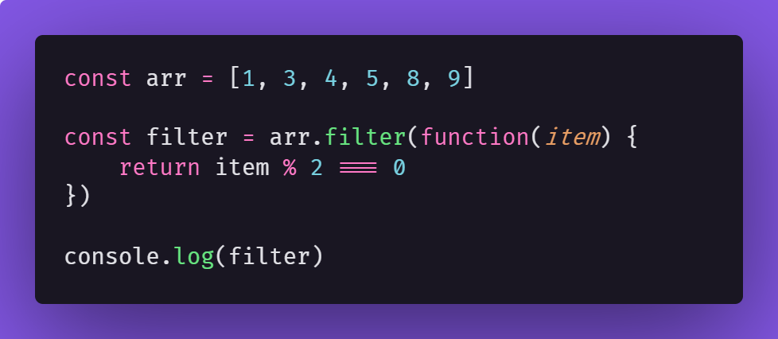
</h2>

No código acima estamos pegando todos números pares do vetor.

Para cada item estamos verificando se o resto da sua divisão por 2 é igual a 0, ou seja, se ele é par. Essa condição tem que retornar ``true`` ou ``false``, se o resultado for ``true`` este item será incluído no novo vetor.

### [Find](https://developer.mozilla.org/pt-BR/docs/Web/JavaScript/Reference/Global_Objects/Array/find)

O ``find`` é utilizado quando desejamos verificar se existe uma informação dentro do vetor.

<h2 align="center">
    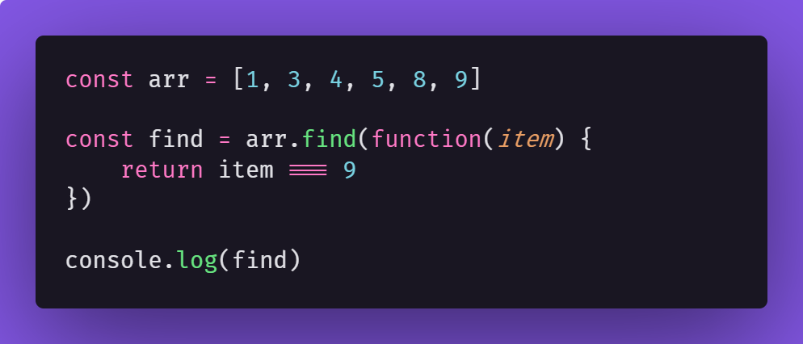
</h2>

No código acima estamos verificando se existe o número 9 dentro do vetor.

Se o ``find`` conseguir encontrar o número, ele vai retornar exatamente o número, caso contrário ele vai retornar **undefined**.


## [🚀 Arrow Functions](https://developer.mozilla.org/pt-BR/docs/Web/JavaScript/Reference/Functions/Arrow_functions)

É uma nova forma de criar funções. Esta nova forma tem uma estrutura reduzida quando comparada a sintaxe de uma função comum.

**Veja o exemplo abaixo:**

<h2 align="center">
    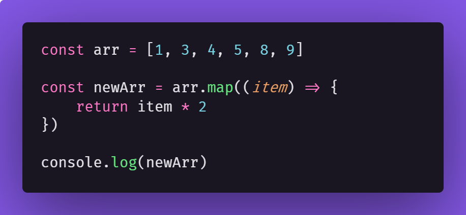
</h2>

O melhor lugar para usar uma ``arrow function`` é em funções anônimas. **Veja como utilizar:** 

- Primeiro: Remova a palavra-chave ``function``
- Segundo: Entre os parênteses e as chaves adicione um sinal de igual junto com um sinal de maior ``=>`` como se fosse uma flecha.

<h2 align="center">
    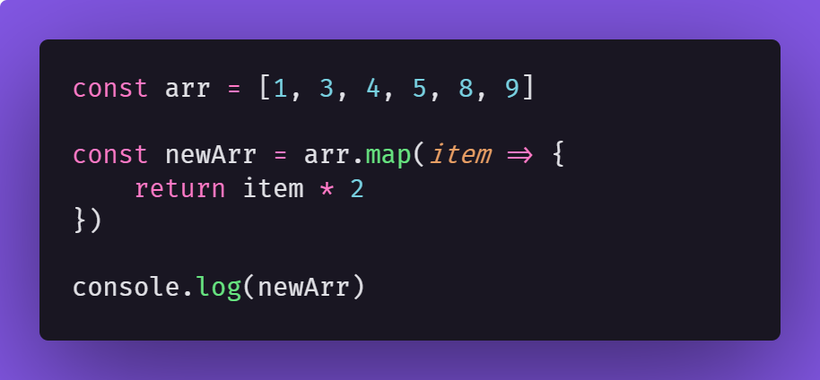
</h2>

Quando a função recebe apenas um parâmetro, nós podemos remover os parênteses que envolvem o parâmetro. Veja no exemplo acima.

<h2 align="center">
    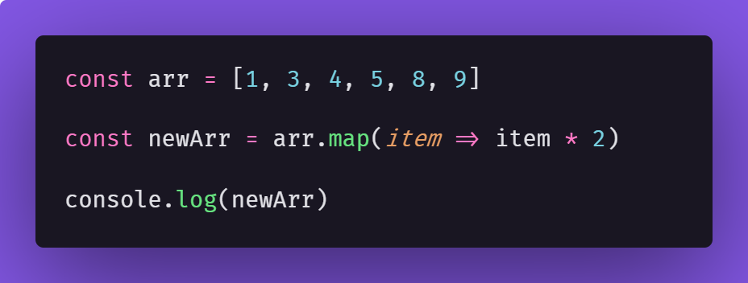
</h2>

Ainda podemos reduzir mais um pouco. Quando nossa função retorna simplesmente uma informação e não várias linhas, nós podemos omitir a palavra-chave ``return`` e também remover as chaves.

Veja como o código se tornou menos verboso.

<h2 align="center">
    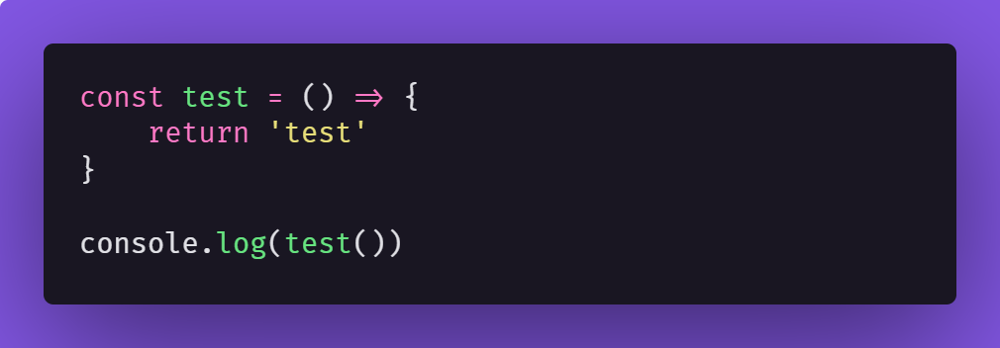
</h2>

No código acima estamos criando uma função utilizando uma constante. É possível, porém não é uma forma recomendada para criar funções.

<h2 align="center">
    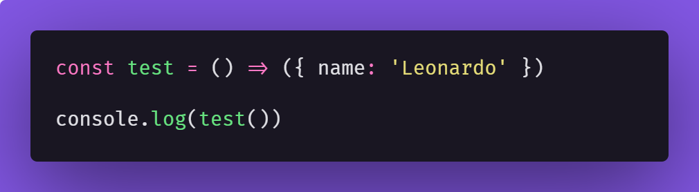
</h2>

Devemos prestar atenção em um detalhe. Podemos retornar um vetor, número e string diretamente após a "flecha", mas um objeto não, se tentarmos retornar um objeto diretamente o resultado será ``undefined``

Isso acontece devido o uso de chaves ``{ }`` elas servem para criar objetos mas também servem para definir o corpo da função. Então a maneira adequada de retornar um objeto diretamente é envolvendo o mesmo entre parênteses.

**OBS:** *Arrow functions não podem ser usadas como construtores e lançarão um erro quando usadas com o ``new``*

## [🚀 Valores padrão](https://developer.mozilla.org/pt-BR/docs/Web/JavaScript/Reference/Functions/Parametros_Predefinidos)

A inserção de valores padrão para parâmetros de funções é uma das funcionalidades mais úteis do ES6. Funciona tanto para funções comuns, quanto para arrow functions. **Veja os exemplos abaixo:**

<h2 align="center">
    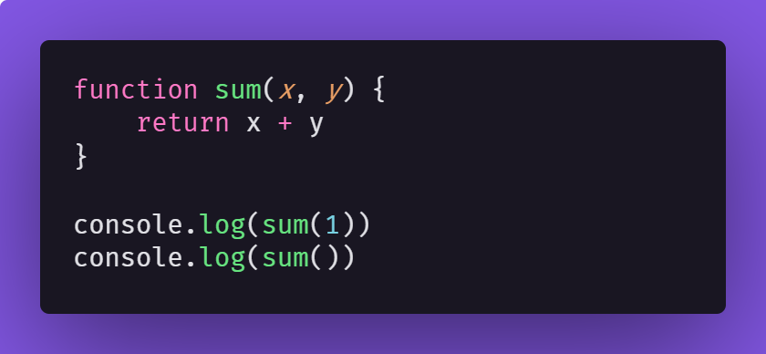
</h2>

No código acima as duas execuções da função retornariam ``NaN`` isso significa que a função não conseguiu identificar os valores que devem ser somados. Na primeira execução apenas passamos o parâmetro ``x`` e na segunda execução não informamos nenhum parâmetro.

<h2 align="center">
    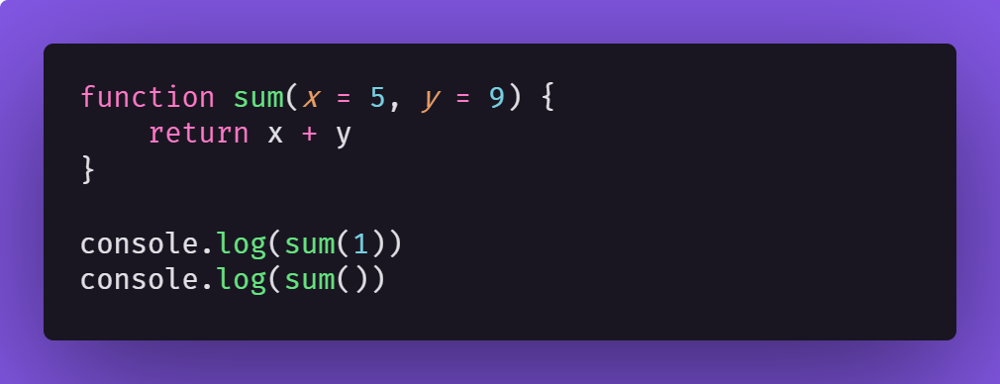
</h2>

Nesse caso as funções seriam executadas sem problema algum, pois definimos valores padrão para os parâmetros. A primeira execução retornaria ``10`` e a segunda ``14``

<h2 align="center">
    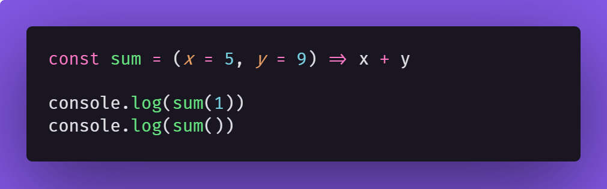
</h2>

Aqui estamos criando exatamente a mesma função, utilizando os mesmos valores. A única diferença é que construímos no formato de arrow function.

## [🚀 Desestruturação](https://developer.mozilla.org/pt-BR/docs/Web/JavaScript/Reference/Operators/Atribuicao_via_desestruturacao)

Vamos falar um pouco sobre desestruturação de objetos no JavaScript, **veja os exemplos abaixo:**

<h2 align="center">
    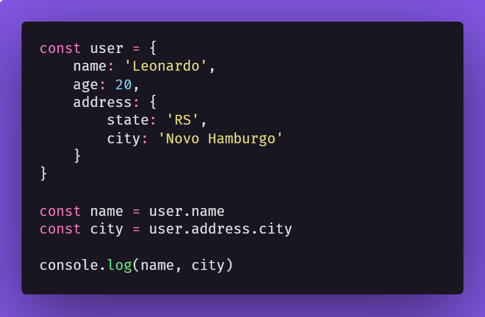
</h2>

Provavelmente você faria da maneira acima para pegar o nome e cidade do usuário. Porém temos uma forma de fazer a mesma coisa com um código mais limpo.

<h2 align="center">
    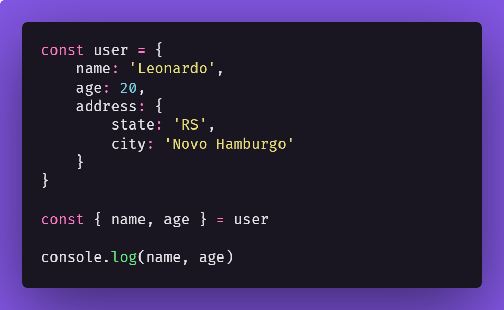
</h2>

No código acima estamos usando o conceito de desestruturação de objetos, você pode perceber que pegamos o nome e idade do usuário utilizando apenas uma linha. 

É muito simples utilizar este conceito. Primeiramente você deve abrir um objeto do lado esquerdo do igual e dentro dele informar o nome das propriedades que vai buscar do usuário, por fim basta passar o nome do objeto depois do igual.

<h2 align="center">
    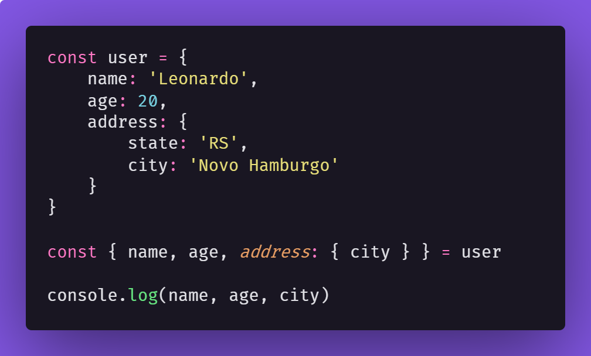
</h2>

E se eu quiser desestruturar a cidade do endereço? 

Neste caso você deve passar o nome da propriedade, no caso ``endereço``, em seguida acrescentar dois pontos e abrir um novo objeto passando quais informações do endereço deseja buscar.

<h2 align="center">
    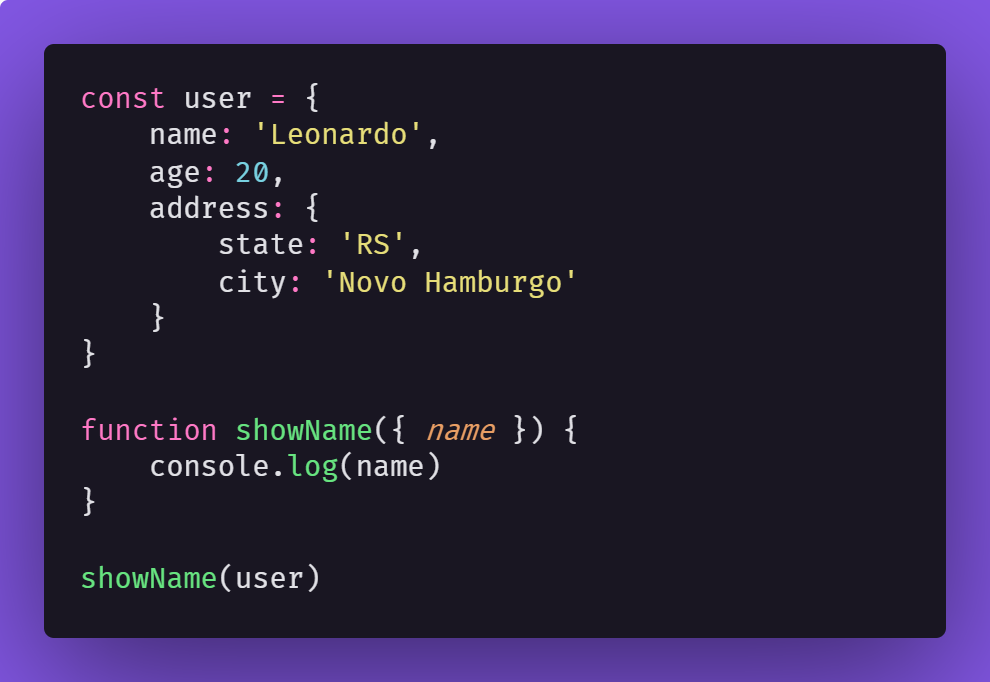
</h2>

A desestruturação pode ser usada em vários outros locais, no exemplo acima estamos utilizando em uma função.

Neste caso temos uma função que mostra o nome do usuário, quando chamamos esta função estamos passando o objeto ``user`` inteiro. Então podemos desestruturar o nome do usuário no próprio parâmetro da função. O código vai executar sem problemas.

## 🚀 [Operadores Rest/Spread](https://developer.mozilla.org/pt-BR/docs/Web/JavaScript/Reference/Operators/Spread_syntax)

Estes são operadores que são conhecidos por usar três pontos, um ao lado do outro.

Mas antes de utilizá-los nós precisamos instalar um novo pacote em nosso projeto, pois os operadores **rest/spread** ainda não foram acoplados na versão principal do Babel, vamos instalar em formato de plugin.

**Execute o seguinte comando para instalar o pacote:**

```
yarn add @babel/plugin-proposal-object-rest-spread
```

O próximo passo é abrir o arquivo **.babelrc** na raíz do nosso projeto e criar um novo array de ``plugins``, passando o plugin instalado. **Veja abaixo o resultado:**

<h2 align="center">
    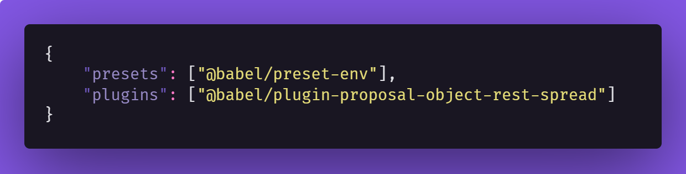
</h2>

### Rest

O **rest** serve para pegar o resto das propriedades. O que seria esse resto? Vamos ver no exemplo abaixo.

<h2 align="center">
    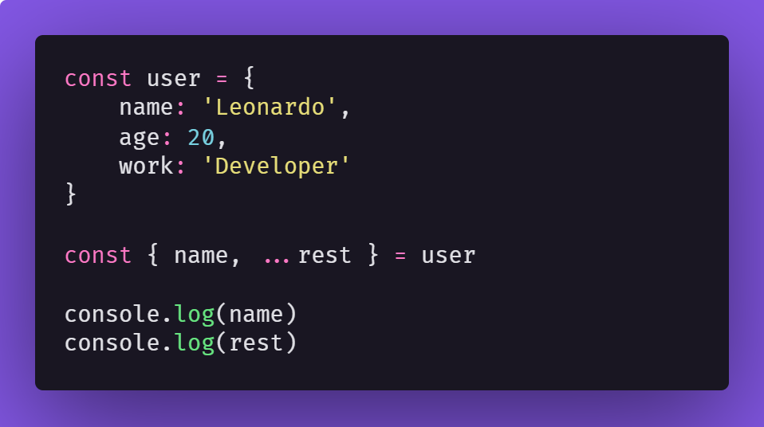
</h2>

No código acima temos um objeto de usuário, suas propriedades são nome, idade e trabalho.

Usando o conceito de desestruturação estamos pegando o nome do usuário. O restante das informações do usuário serão armazenadas em outra variável, aí que entra o operador **rest**, usando três pontos e o nome da variável que desejamos armazenar as informações já conseguimos solucionar esta tarefa.

O primeiro ``console.log()`` retorna o nome do usuário e o segundo um objeto com as informações restantes.

<h2 align="center">
    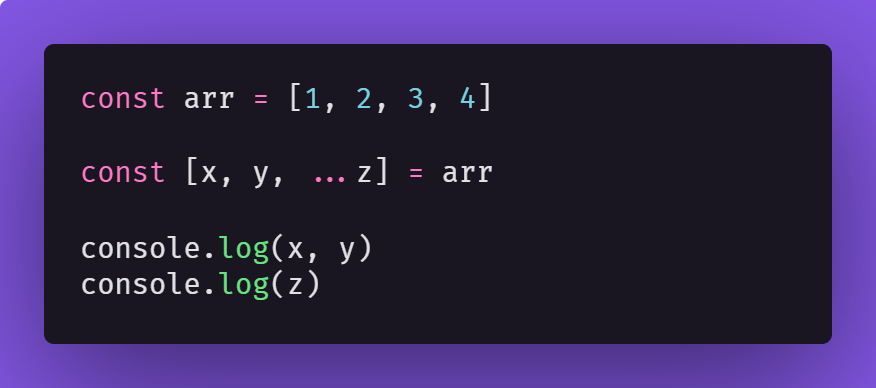
</h2>

Também podemos aplicar este conceito em vetores, como no exemplo acima.

Estamos usando a desestruturação para pegar as duas primeiras posições do array nas variáveis ``x`` e ``y``  

O resto está sendo armazenado na variável ``z`` usando o operador rest.

O ``console.log()`` da variável ``z`` retorna um array com ``[3, 4]``

<h2 align="center">
    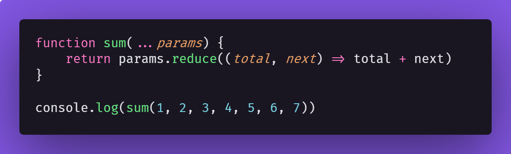
</h2>

Outra forma de utilizar o operador rest é em parâmetros de funções.

No código acima temos uma função de soma que recebe vários números como parâmetro, você deve concordar comigo que seria muito trabalhoso pegar número por número e somar.

Então, primeiro estamos utilizando o rest para pegar todos parâmetros e armazenar na variável ``params``, esses valores ficam em formato de array. Em seguida usamos o método ``reduce`` para manipular este array e somar todos valores, você também pode notar que estamos usando o formato de **arrow function**.

O ``console.log()`` retorna **28**.

### Spread

Ele tem uma funcionalidade um pouco distinta do rest. Enquanto o rest pega o resto de algo, o **spread** faz o papel de propagar, ou seja, repassar as informações de um objeto ou array para outra estrutura de dados. **Veja os exemplos abaixo:**

<h2 align="center">
    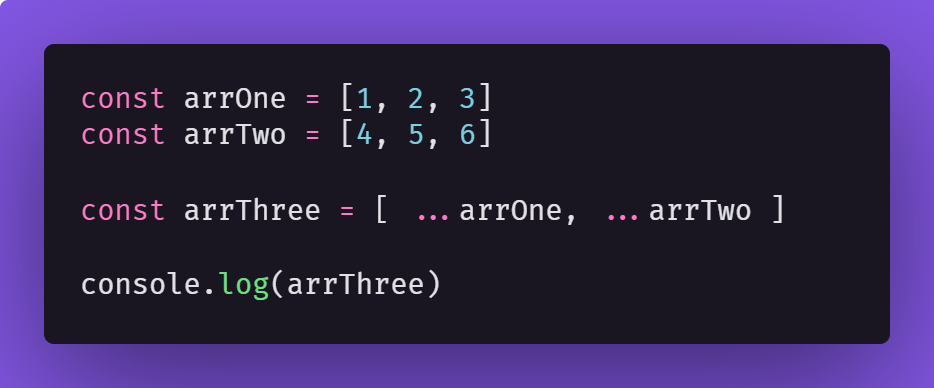
</h2>

No código acima temos dois arrays. Como você faria para unir os dois? 

Com o **spread** nós podemos criar um terceiro array e espalhar o conteúdo dos outros arrays dentro. Basta colocar três pontos e informar o nome do array que vai espalhar o conteúdo.

O ``console.log()`` retorna ``[1, 2, 3, 4, 5, 6]``

<h2 align="center">
    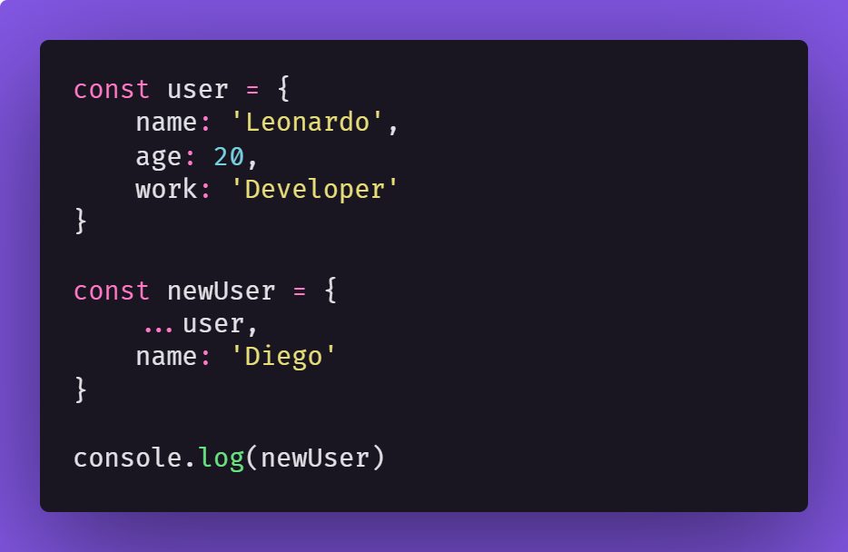
</h2>

No código acima temos um objeto de usuário e queremos criar um novo objeto com as mesmas propriedades, exceto a propriedade ``name``. Para isso vamos utilizar o operador spread.

Primeiro criamos um novo array com o nome de ``newUser`` e depois utilizamos os três pontos para espalhar todo conteúdo do array ``user`` nele, e por fim subscrevemos a propriedade ``name``

O ``console.log()`` vai retornar um objeto com as mesmas propriedades, exceto o nome que foi alterado.

## 🚀 [Template Literals](https://developer.mozilla.org/pt-BR/docs/Web/JavaScript/Reference/template_strings)

Template Literals é uma nova forma de incluir variáveis dentro de strings. **Veja os exemplos abaixo:**

<h2 align="center">
    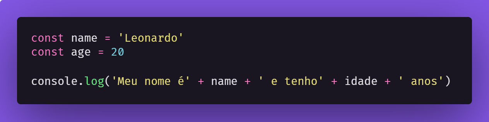
</h2>

Provavelmente você faria da forma acima para unir variáveis com strings, mas veja como é trabalhoso fazer muitas concatenações e além disso a sintaxe do código fica de certa forma "feia".

Agora vamos ver um exemplo utilizando template literals.

<h2 align="center">
    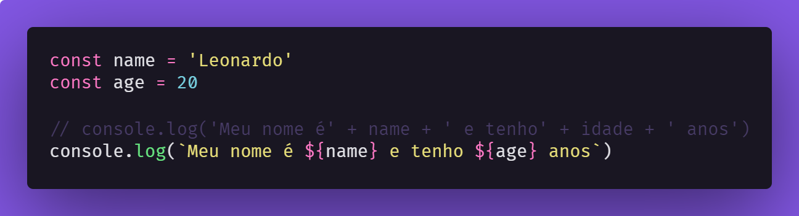
</h2>

É muito simples de utilizar, no lugar das aspas simples ou duplas nós vamos utilizar o sinal de crase e quando quisermos incluir uma variável, primeiro vamos incluir o sinal de dólar e depois vamos abrir e fechar chaves, basta incluir o nome da variável entre as chaves.

Você pode ver que o código ficou muito mais limpo e vai funcionar da mesma forma.

## 🚀 Object Short Syntax

Agora vamos ver um pouco sobre **object short syntax** ou **sintaxe curta de objeto**.

<h2 align="center">
    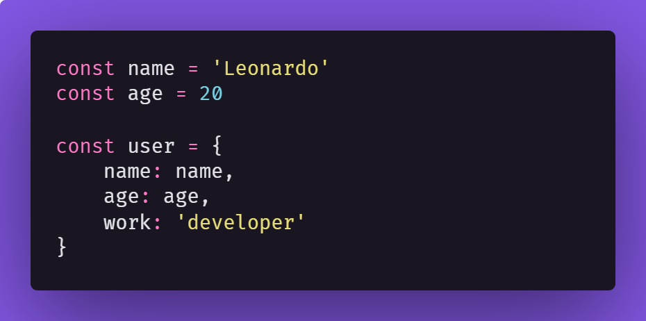
</h2>

Vamos supor um caso que você precisa repassar as variáveis nome e idade para um objeto de usuário.

Veja que no objeto colocamos os nomes das propriedades repetindo o nome das variáveis, com ES6 podemos fazer de uma forma diferente.

<h2 align="center">
    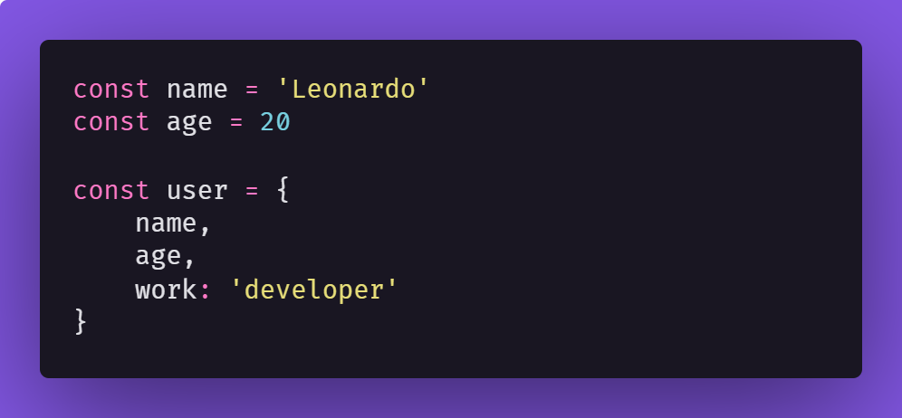
</h2>

Quando o nome da propriedade é igual o nome da variável dentro de um objeto, nós podemos deixar apenas um deles, como no exemplo acima.

## 📜 Licença
Realizado em 2020. Esse projeto está sob a [licença MIT](./LICENSE).

Feito com 💚 por [Leonardo Campello](https://br.linkedin.com/in/leonardo-campello-6151a71a5)